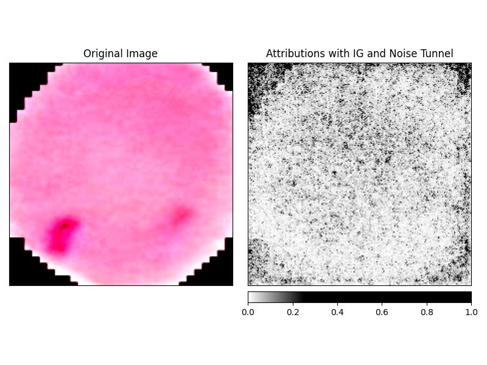

# Raport - Klasyfikacja Anomalii Erytrocytów

Repozytorium: [Project Neural Classification of Erythrocyte Anomalies](https://github.com/Gwidi/Project-Neural-Classification-of-Erythrocyte-Anomalies)

## 1. Architektura Sieci Neuronowej
Projekt oparty na **transfer learning** (ResNet-18, IMAGENET1K_V1). Zamrożone warstwy konwolucyjne, dostosowana warstwa klasyfikacyjna:
- `Linear(512 → 128)` → `ReLU` → `Dropout(0.5)` → `Linear(128 → 2)`

## 2. Funkcja Straty
**CrossEntropyLoss** - łącząca Softmax i NLL Loss.

## 3. Optimizer
**AdamW** - Optymalizator z regularyzacją i lr=1e-3.

## 4. Scheduler
**ReduceLROnPlateau** - Dynamiczne zmniejszanie szybkości uczenia:
- Parametry: factor = 0.1, patience = 2
- Monitorowana metryka: `val_loss`

## 5. Hiperparametry
| Hiperparametr          | Wartość    |
|------------------------|------------|
| Learning Rate          | 1e-3 (zredukowany zgodnie z schedulerem) |
| Batch Size             | 32         |
| Max Epochs             | 100         |
| Dropout Rate           | 0.5        |
| Train/Val Split        | 80/20   |
| Random Seed            | 42         |

### Augmentacja danych
Zastosowano transformacje: rotacje, flipy, manipulacje kolorem, center cropping. Obrazy skalowano do rozmiaru `224x224`.

## 6. Metryki Ewaluacji
Monitorowane metryki:
- **Accuracy**: Dokładność
- **F1 Score**: Harmoniczna Precision i Recall
- **Precision**: Precyzja klasyfikacji
- **Recall**: Czułość klasyfikacji

## 7. Podsumowanie Treningu
- Framework: PyTorch Lightning
- Akcelerator: GPU
- Logger: WandB
- Checkpoint: Minimalizacja `val_loss`

## 8. Dataset
Zbiór ~22k obrazów pojedynczych erytrocytów:
- Klasa pozytywna: Zainfekowane komórki
- Klasa negatywna: Zdrowe erytrocyty
- Źródło: Barwione preparaty krwi (metoda Giemsy)

## 9. Wizualizacje
### Przykład wizualizacji wyników

Powyższa wizualizacja przedstawia attribution map wygenerowaną metodą **Integrated Gradients** z **Noise Tunnel**. 
- **Lewa strona**: Oryginalny obraz erytrocytu
- **Prawa strona**: Heatmapa pokazująca piksele zwiększające predykcję klasy

**Obserwacja**: Model przypisuje istotną wagę nie tylko komórce, ale również ciemnemu tłu, mimo zastosowania CenterCrop

## 10. Wyniki
| Metryka          | Train | Validation |
|------------------|-------|------------|
| Accuracy         | 93.3% | 93.0%      |
| F1 Score         | 93.4% | 92.7%      |
| Precision        | 93.1% | 95.6%      |
| Recall           | 93.6% | 90.0%      |

Najlepszy model osiągnięto w epoce 46 z `val_loss=0.20`.

---